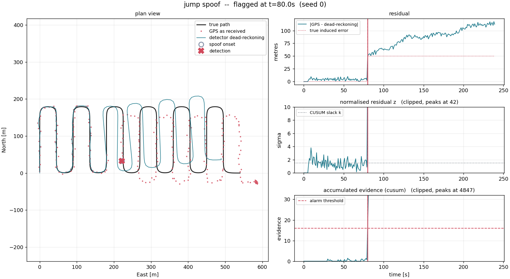
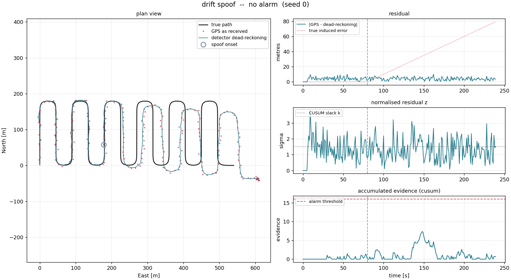
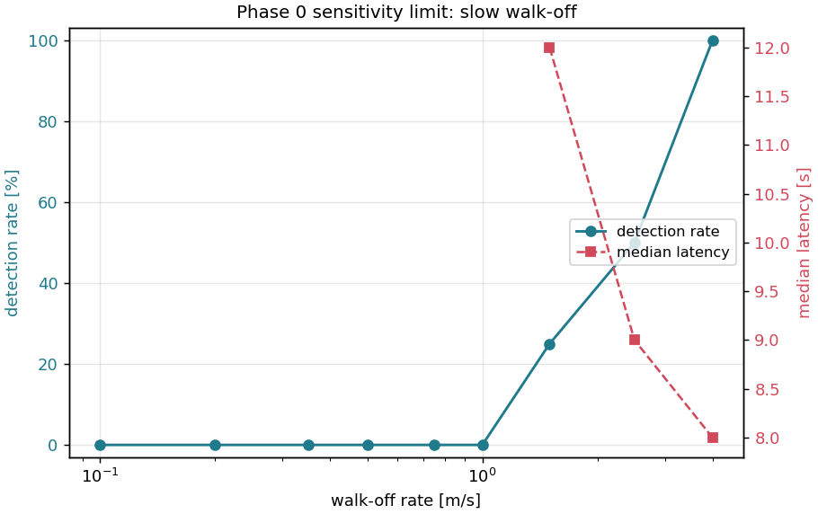

# GNSS Spoofing Detection Layer

**Detecting GPS spoofing on a UAV by cross-checking the GNSS fix against
inertial dead-reckoning.**

Jamming denies the signal and the autopilot notices immediately. Spoofing feeds
a *false but plausible* position that the autopilot keeps trusting — so the
aircraft flies confidently to the wrong place. It is the subtler problem, the
more dangerous one, and far less solved. This repository is a working detector
for it, built from the sensor models up, with every claim measured rather than
asserted.

> **No RF is transmitted anywhere in this project.** All spoofing is injected in
> software. See [Legality](#legality) — this is both the lawful approach and the
> better one for measurement.

---

## Status — Phase 0 complete

| attack | detection | false alarms/hour | latency (p50 / max) |
| ------ | --------- | ----------------- | ------------------- |
| clean flight | — | **0.00** | — |
| **jump** (50 m teleport) | **100 %** | 0.00 | 0 s / 1 s |
| **replay** (25 s loop-back) | **100 %** | 0.00 | 3 s / 3 s |
| **walk-off drift** (0.5 m/s) | **0 %** | 0.00 | not detected |

16 independent seeds per scenario, 240 s survey flight, 100 Hz IMU, 1 Hz GPS.
Zero false alarms across 56 minutes of clean flight.

**What works:** sudden and replay-based spoofing are caught reliably and
quickly, with no false alarms.

**What does not, and why it is stated here first:** a slow walk-off below about
1 m/s is not detected at all. That is the threat that matters most, the
boundary is measured precisely (below), and closing it is the entire purpose of
Phases 1–2. A detector that hides its failure mode is not a detector.

---

## The idea in one table

Everything rests on GPS and an IMU failing in *opposite* ways:

|                 | GPS                                        | IMU                                             |
| --------------- | ------------------------------------------ | ----------------------------------------------- |
| Error over time | Bounded — a few metres, forever            | Grows as t^1.5 from noise, t² from bias         |
| Forgeable?      | **Yes** — a ~20 W signal from 20 000 km up | **No** — it measures the airframe's own physics |

The IMU is an **unforgeable but short-sighted witness**. Over seconds to tens of
seconds it is accurate enough to audit GPS before its own drift swamps the
comparison. The detector lives inside that window, continuously asking:

> *GPS claims I moved 12 m north. My accelerometers felt a motion consistent
> with 3 m north. One of you is lying — and only one of you can be lied to.*

## Architecture

```
                 body-frame accel, gyro          AHRS heading
 IMU (100 Hz) ─────────────────────────┐        (magnetometer-based,
                                       │         INDEPENDENT of GNSS)
                                       v              │
                            ┌──────────────────────┐  │
                            │ strapdown            │<─┘
                            │ dead-reckoning       │
                            │ (trapezoidal)        │
                            └──────────┬───────────┘
                                       │ independent position estimate
                                       v
 GNSS (1 Hz) ──────────────────> ( compare ) ──> residual
 position fix                          │
   ▲                                   v
   │                        ┌────────────────────────┐
   │                        │ normalise by LEARNED   │  <- adaptive threshold
   │                        │ median + robust scale  │
   │                        └──────────┬─────────────┘
   │                                   v
   │                        ┌────────────────────────┐
   │                        │ CUSUM change detector  │
   │                        └──────────┬─────────────┘
   │                                   v
   │                           {spoofed, score, reason}
   │                                   │
   └───── anchor (alpha-beta) <─────────┘  cut on alarm, then coast inertial
```

The detector sees only what a real flight computer would: body-frame IMU, an
AHRS heading, and a GPS position. It never sees ground truth — there is no code
path to it, and a test enforces this. That boundary is what keeps the
evaluation honest, and what makes the Phase 3 port to live hardware a
replacement of one loop rather than a rewrite.

## Three design decisions worth defending

**1. Alarm on a *change* in the residual, not on a large residual.** The
residual is never zero: accelerometer turn-on bias puts dead-reckoning at a
standing lag behind GPS forever, and attitude error adds more during
manoeuvres. Threshold the raw residual and you must set that threshold above
all of it, throwing away your sensitivity. Instead the detector learns the
residual's own median and robust scale during quiet flight and alarms on
departures from it. A standing nuisance offset is absorbed; a new one is not.

**2. Heading comes from the AHRS, never from GPS course over ground.** An early
version derived heading from successive GPS fixes. That is wrong twice over: it
is barely observable (3.5 m of position noise across a 12 m step is 17° of
course error), and far worse, it hands the attacker the very reference being
used to audit them. A magnetometer-based heading sits outside the spoofer's
reach, and that independence is the entire source of the detector's leverage.

**3. The velocity-anchoring gain is the crux of the whole problem.** A walk-off
spoof is a position ramp, and any filter that freely adapts its velocity adopts
the attacker's ramp as truth — after which the residual collapses back into the
noise and the attack is invisible. But the accelerometers *know* the aircraft
never accelerated to that velocity. Velocity is precisely the state to trust the
IMU on and GPS least. Phase 2 stops setting this gain by hand: it falls out of
the Kalman covariance.

---

## Results

Detection rate is per *run*, and a run only counts as detected if it had not
already false-alarmed. False alarms are counted as **alarm onsets per hour** of
clean flight, not as flagged epochs — the detector latches, so counting epochs
would turn a single false alarm into an 80 % "rate" and mean nothing.

### Jump — caught on the first corrupted fix



Dead-reckoning (teal) tracks the true path (black) exactly until the attack. At
onset the detector latches, stops trusting GPS, and coasts on inertial — which
is why teal then diverges from the spoofed fixes (red). With a 1 Hz receiver,
0–1 s is the physical floor on latency.

### Replay — caught in 3 seconds

A replay attack feeds back the aircraft's own track from 25 s earlier, spliced
so the handover is continuous. Every speed and turn in that stream is real —
the airframe genuinely flew it — so **any plausibility check on the GPS data
alone would pass**. It breaks only against an independent witness. At 12 m/s,
3 s is 36 m of error before the alarm.

### Walk-off drift — the failure, and the reason for Phase 2



This is the most informative figure in the repository. The detector's estimate
(teal) **follows the lie**, tracking the spoofed fixes away from the true path.
The residual spikes to 7.6 m about ten seconds after onset, then *decays back
into the noise* while the true induced error climbs past 77 m. Accumulated
evidence peaks at 7.4 against a threshold of 16 and never crosses.

The mechanism: the detector tracks velocity as well as position, and a slow
position ramp is indistinguishable from the aircraft genuinely flying slightly
faster in that direction. The filter quietly accepts the new velocity as truth.
The attacker wins by being gentle.

Mapped across walk-off rates (12 seeds each):



| walk-off rate      | ≤ 1.0 m/s | 1.5 m/s | 2.5 m/s | 4.0 m/s |
| ------------------ | --------- | ------- | ------- | ------- |
| detection          | **0 %**   | 25 %    | 50 %    | 100 %   |
| median latency     | —         | 12 s    | 9 s     | 8 s     |
| offset when caught | —         | 18 m    | 23 m    | 32 m    |

**Why this is a result and not an excuse.** "We don't catch slow drift" is
hand-waving. "We catch 0 % at 1 m/s, 50 % at 2.5 m/s and 100 % at 4 m/s, here is
the mechanism, and here is what must change" is engineering — and it means
Phase 2's improvement will be provable rather than claimed.

The deeper reason is the argument for Phase 2, stated plainly: **a residual
normalised by its own observed scatter can never detect a slow ramp, because a
slow ramp is indistinguishable from the very nuisance drift that normalisation
exists to absorb.** Escaping it requires a threshold derived from a *model* of
sensor noise rather than from observed scatter — which is exactly what an EKF's
innovation covariance provides.

### CUSUM vs the obvious baseline

The naive rule — flag after N consecutive fixes above M sigma — is implemented
as `--mode nsigma` so the comparison is on the record. On jump they tie at
100 %. On a 0.5 m/s walk-off, accumulating evidence wins outright:

| method              | best drift detection | at FA/hour |
| ------------------- | -------------------- | ---------- |
| n-sigma (3 × 2.0 σ) | 37 %                 | 6.5        |
| **CUSUM**           | **75 %**             | 10.8       |

A single epoch of a gentle walk-off never looks suspicious, so a per-epoch
threshold has nothing to fire on. CUSUM integrates the small persistent bias
instead.

*ROC caveat:* at 8 trials the resolution floor is one onset in 1680 clean
epochs, about 2 FA/hour, so a plotted `0.00` means "below 2", not zero. The CLI
prints this floor rather than letting the figure imply more precision than the
sampling supports.

### Gains chosen by measurement, across the operating envelope

`vel_gain` is the crux parameter, and measuring it over too narrow an envelope
picks the wrong value. On 240 s flights, `vel_gain = 0` looks strictly best:

| vel_gain  | FA/hour (240 s) | drift 0.5 | drift 1.0 | drift 2.5 |
| --------- | --------------- | --------- | --------- | --------- |
| 0.000     | 0.00            | 0 %       | **17 %**  | **58 %**  |
| 0.002     | 0.00            | 0 %       | 8 %       | 58 %      |
| **0.005** | 0.00            | 0 %       | 0 %       | 50 %      |
| 0.020     | 0.00            | 0 %       | 0 %       | 33 %      |
| 0.050     | 0.00            | 0 %       | 0 %       | 0 %       |

Extend the flight and `vel_gain = 0` falls apart — with nothing correcting
velocity, error from accelerometer bias grows without bound:

| FA/hour on clean flight | 240 s | 480 s | 900 s |
| ----------------------- | ----- | ----- | ----- |
| vel_gain = 0.000        | 0.00  | 3.21  | 1.66  |
| vel_gain = 0.002        | 0.00  | 2.41  | 0.83  |
| **vel_gain = 0.005**    | 0.00  | 0.00  | 0.00  |
| vel_gain = 0.020        | 0.00  | 0.00  | 0.00  |

0.005 is the smallest gain that stays quiet out to 900 s, so that is the
default — **the best-performing value on the short test was a bug in waiting.**
The alarm threshold `cusum_h = 16` was set the same way: the peak clean-flight
accumulator over 30 runs was median 5.9, p90 9.3, max 10.5, so 16 leaves about
1.5× margin on the worst observed clean flight. Both are properties of *this*
vehicle's noise, not universal constants — re-measure them when the airframe,
IMU or flight profile changes.

---

## Two bugs that shaped the design

Both were found by measurement rather than by reading the code, and both are
the kind of thing that silently ruins this class of detector.

**Forward-Euler integration cost 17 metres.** Free-running the dead-reckoning
with a *noise-free* IMU should give near-zero error. It gave 17 m at 120 s.
Forward Euler leaves a half-sample lag in heading, a lagging heading misrotates
the accelerometers, and that misrotation integrates into position error the same
size as the attacks being detected. Trapezoidal integration brings it to ~2.5 m,
below the GPS noise floor, for two extra adds per sample.
*Lesson: test the estimator with perfect inputs first. If it cannot get the
right answer on noise-free data, nothing downstream means anything.*

**A "clever" safety feature created a positive feedback loop.** Scaling the
anchoring gain down as suspicion rose looked prudent — don't let a spoofer drag
the reference it is being measured against. But weaker anchoring raises the
residual, a higher residual raises suspicion, and that weakens anchoring
further. Cost: 10 false alarms in 12 clean runs while the underlying residual
was perfectly healthy (z median 1.19, p99 3.13). The same trap reappeared via
the statistics-learning gate, which froze the scale estimate when the
accumulator rose, biasing z upward. Both now use non-accumulating tests, and the
attacker's ability to drag the reference is bounded structurally instead — by how
small `vel_gain` is.
*Lesson: feedback from a decision back into the measurement driving that
decision is almost always a trap.*

---

## Roadmap

### Phase 0 — simulation harness + consistency detector ✅ complete

Spoof-injection simulator (jump / walk-off / replay), strapdown dead-reckoning,
adaptive-threshold residual monitoring with CUSUM change detection, and a full
evaluation harness. Results above.

### Phase 1 — full 3-D dead-reckoning and measured noise

Phase 0 works in a 2-D horizontal plane with heading supplied by the AHRS.
Phase 1 removes those simplifications, which is where inertial navigation gets
genuinely hard:

- **Quaternion attitude propagation** — track full orientation, not just
  heading, integrating gyro rates without the singularities Euler angles bring.
- **Gravity compensation.** In 3-D the accelerometer measures specific force,
  which is dominated by a 9.81 m/s² gravity vector that must be subtracted using
  the estimated attitude. This becomes the dominant error source: **1° of tilt
  error injects 0.17 m/s² of false horizontal acceleration — four times the
  accelerometer noise modelled in Phase 0.**
- **Measured IMU noise via Allan variance.** Log a real MPU-6050 stationary for
  30–60 minutes, extract actual bias instability and random-walk coefficients,
  and feed those into the simulator. This converts "noise from datasheets" into
  "noise measured from the hardware", which removes the strongest possible
  criticism of a simulation-based result.
- **Real flight dynamics** from public PX4/ArduPilot logs instead of synthetic
  paths.

*Deliverable:* detection and false-alarm figures for jump vs drift under 3-D
dynamics with measured sensor noise.

### Phase 2 — EKF with innovation monitoring (the rigorous method)

The method that closes the slow-walk-off gap, and the one that is citable.

An Extended Kalman Filter fuses IMU and GPS, carrying accelerometer bias and
gyro bias as estimated states rather than as nuisances to be absorbed. The
detector then monitors the **innovation** — the difference between what GPS
reported and what the filter predicted.

In a correctly tuned filter on honest data, the innovation is zero-mean with a
*known* covariance `S = H P Hᵀ + R`. Normalising it gives the **Normalised
Innovation Squared**, which follows a **chi-squared distribution**. That yields
a threshold derived from statistics rather than from observed scatter: "flag at
the 99th percentile of χ²" carries a defensible false-alarm rate by
construction. A spoofer injects a persistent *bias*, and biased innovation
exceeds the χ² bound and stays there — detectable at amplitudes far below
anything Phase 0 can reach.

This is an established technique; the literature calls it **INS-aided RAIM**
(Receiver Autonomous Integrity Monitoring), or tightly-coupled integrity
monitoring.

*Deliverable:* ROC curves and latency comparison against the Phase 0 baseline,
with the walk-off detection boundary pushed well below 1 m/s.

### Phase 3 — live hardware bench demonstration

Port the detector to an ESP32 reading a real MPU-6050 over I²C and a u-blox
NEO-M8N over UART — parsing the **UBX binary protocol** rather than NMEA, to
reach `UBX-NAV-STATUS` (which carries u-blox's own `spoofDetState` flag) and
per-satellite C/N0. The spoof is injected into the incoming stream in software,
on the wire, never over the air. Alarm drives an LED and buzzer.

Because the Phase 0 detector already consumes only sensor readings, this is a
replacement of the input loop, not a rewrite.

*Deliverable:* 60–90 s video of the detector flagging a live injected spoof.

### Phase 4 — stretch

- **TEXBAT** (Texas Spoofing Test Battery) — validation against the standard
  academic dataset.
- **Visual-inertial cross-check** — vision-based odometry disagreeing with GPS
  is independent evidence of spoofing.
- **Swarm cross-validation** — neighbouring aircraft whose relative positions
  contradict your own fix.
- **Autonomous response** — on detection, drop GPS, navigate inertially/visually,
  return to home.

---

## Run

```bash
pip install -r requirements.txt
```

```bash
python -m eval.run --scenario all --trials 16    # full results table + figures
```

```bash
python -m eval.run --drift-sweep                 # where the detector gives out
```

```bash
python -m eval.run --gain-sweep                  # the vel_gain trade-off
```

```bash
python -m eval.run --roc --mode both             # CUSUM vs n-sigma baseline
```

```bash
python -m tests.test_smoke                       # 9 tests, no pytest required
```

Requires only numpy, scipy and matplotlib.

The tests pin the properties that break silently: seed reproducibility, that the
sensor stream never leaks ground truth, that the spec's `step()` facade agrees
exactly with the tight-loop API, and — deliberately — that a 0.5 m/s walk-off is
*not* detected, so whichever phase fixes that trips the test loudly instead of
passing unnoticed.

## Layout

```
sim/        trajectory.py  ground-truth flight paths (survey/orbit/line/hover)
            sensors.py     IMU, AHRS and GPS error models
            spoofer.py     the adversary: jump / walk-off drift / replay
            scenario.py    assembles one replayable run; owns the truth boundary
detector/   consistency.py SpoofDetector: step_imu() / step_gps() / step()
eval/       metrics.py     detection rate, false-alarm rate, latency
            plots.py       figures
            run.py         CLI; the only place sim and detector touch
tests/      test_smoke.py  9 tests
```

1 773 lines of Python.

## Limitations

Stated plainly, because overclaiming is worse than the gaps themselves.

- **Software-injected spoofing is not RF spoofing.** This detector works at the
  position-solution layer only. A real attack also leaves signal-layer
  fingerprints — C/N0 and AGC anomalies, carrier-phase discontinuity, loss of
  multipath diversity, inconsistent satellite geometry — none of which are
  modelled. A u-blox receiver's own `spoofDetState` watches some of them, so
  this approach is *complementary* to receiver-level checks, not a replacement.
- **Slow walk-off is unsolved below ~1 m/s.** Quantified above. Phase 2 is aimed
  squarely at it.
- **IMU noise parameters are datasheet-order, not measured**, and tuning a
  detector against assumed noise risks a self-fulfilling result. Phase 1's Allan
  variance work addresses this directly.
- **2-D horizontal, flat-earth, gravity-free.** Altitude is held and a level 2-D
  model places gravity entirely on body-z. Phase 1's job.
- **GPS error is modelled as white.** Real receiver error is correlated over
  seconds to minutes (ionosphere, multipath), making a slow spoof harder to
  separate from a degraded sky view.
- **Synthetic trajectories**, not real flight logs.
- **A slow attack can partly teach the detector to accept it**, since residuals
  below the outlier-rejection threshold still enter the learned statistics.
  Bounded by the 40-fix window and by the alarm latch, but real.

## Legality

**Never transmit on GNSS frequencies.** Broadcasting fake GPS signals is illegal
in essentially every jurisdiction and interferes with real navigation, including
civil aviation and emergency services. Every attack in this repository is
applied to a position solution in software.

That is not only the lawful approach, it is the better one for engineering:
holding ground truth is the only way to measure detection latency to the sample,
which an over-the-air test could never give you.
